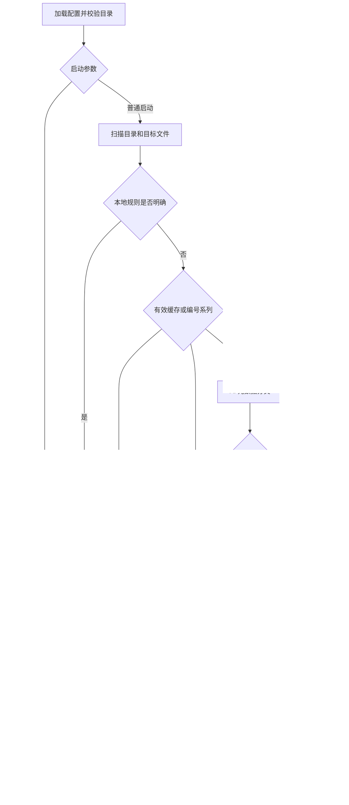

# 架构文档

更新：2026-09-26｜实现基线：0.2.0（分层分类迭代）

## 1. 技术与结构

Java 17 + Maven，运行时使用 JDK 标准库，测试使用 JUnit 5。当前实现集中在 [FileTidyingAssistant.java](../src/main/java/com/example/tidying/FileTidyingAssistant.java)，下表为逻辑职责，并非已拆分的独立模块。

| 职责 | 主要入口 | 输入 / 输出 |
| --- | --- | --- |
| 配置校验 | `Config.load`、`validateConfig` | 工作目录的配置文件 → 运行参数 |
| 目录与文件扫描 | `existingDirectories`、`structure`、`targetFiles` | 根目录 / 目标目录 → 目录索引、树、文件列表 |
| 分类调度 | `localClassification`、`numberedGroups`、`planAll`、`planBatch` | 本地规则、受限文件组 → 未解决文件的批量建议 |
| 建议缓存 | [PlanningCache.java](../src/main/java/com/example/tidying/PlanningCache.java) | 持久化并复核有效 AI 分类，不保存完整计划 |
| 请求控制 | `classifyWithRetry`、`inputBatches`、`AnalysisStats` | 分阶段请求、共享预算、有限重试及统计 |
| 计划校验 | `buildPlan`、`resolveDestination` | AI 建议 → 可展示的逐文件计划 |
| 执行与清理 | `execute`、`deleteEmptyDirectories` | 已确认计划 → 文件移动及空目录清理 |
| 历史与撤销 | `writeHistory`、`undoLast` | 最近一次操作记录 → 反向恢复 |

## 2. 主流程

无待整理文件时直接退出；`--undo-last` 可跳过 AI 分析。所有文件共享一个 300 毫秒观察窗口，前后比较大小和修改时间，不保证文件之后不再变化。

## 3. AI 接口与计划

- 固定线程池控制批次并发，默认 10 文件 / 批、2 批并发，请求超时 90 秒。
- 默认使用第三方 Responses 接口，也有 Chat Completions 分支；真实测试范围见[测试文档](testing.md)。
- Responses 使用 SSE；当前收齐响应后解析文本，终端输出阶段状态，不逐 token 展示。
- 本地规则仅处理明确的发票、备份、旅行照片，要求唯一根级分类目录且无待选择的分类子目录；主题子目录和常见项目标记目录交给 AI。
- 编号系列要求同目录、同扩展名、共同主题前缀、至少 8 个成员。模型看到全部成员名；仅返回 `uniform=true` 且逐成员条件仍成立时展开。组拒绝或出错后回到逐文件路径。
- 元数据请求只含相对路径、类型、大小及至多 2,000 字符的相关目录索引；索引来自完整目录列表，独立于展示深度。
- 结果字段为 `source`、`destination`、`createDirectory`、`reason`、`needsContent`。仅 `needsContent=true` 时读取支持的文本前 1,200 字符，再批量判断一次；仍不确定或不支持内容提取时为 `REVIEW`。
- 每阶段仅补请求未解决项一次；4xx 停止后续请求，连续 3 次无有效结果停止后续请求；已发出的并发请求可继续完成。
- 按文件数与字符预算拆批；所有线程共享请求上限（默认 20），每个提示词最多 12,000 字符。预算包含摘要阶段和重试，超限项为 `REVIEW`。
- `AnalysisStats` 汇总分流数、请求数、重试数、输入字符数和耗时；仅使用平台回报的有效 token 数，全零或缺失时不估算费用。
- 无密钥时走本地扩展名规则。计划状态为 `READY`（可移动）、`UNCHANGED`（保留）、`CONFLICT`（同名冲突）、`FAILED`（失败）、`REVIEW`（待人工判断）。

## 4. 本地数据与边界

- 配置示例：[application.properties.example](../application.properties.example)；实际配置从进程工作目录读取。
- 历史位于 `sense.root/.bei-file-tidying/history/last-operation.json`，只保留最近一次操作，记录相对路径、文件大小、修改时间及创建 / 删除的目录。
- 分类缓存位于 `sense.root/.bei-file-tidying/classifications.properties`；只存有效建议，使用完整目录列表和接口配置的摘要及源文件签名校验。签名含文本前 1,200 字符的本地摘要；密钥只参与摘要计算。`--refresh` 重算；缓存命中仍经 `buildPlan` 校验。
- 历史通过临时文件替换写入，文件系统支持时采用原子替换；移动失败逐项报告，不提供整批事务保证。
- 撤销反向移动文件；依据大小和修改时间判断文件是否变化，不使用内容哈希。原位置冲突、目标丢失或已变化时不覆盖。
- 目录树跳过隐藏目录及符号链接目录；文件扫描仅按文件名过滤隐藏文件，尚未统一排除隐藏父目录。
- 目的地拒绝绝对路径、`.` / `..`、保留目录及已存在的符号链接祖先；执行前再次检查。并发路径替换、严格 JSON 校验和中断恢复仍待完善。

相关文档：[需求](requirements.md) · [测试](testing.md) · [计划](project-plan.md)
