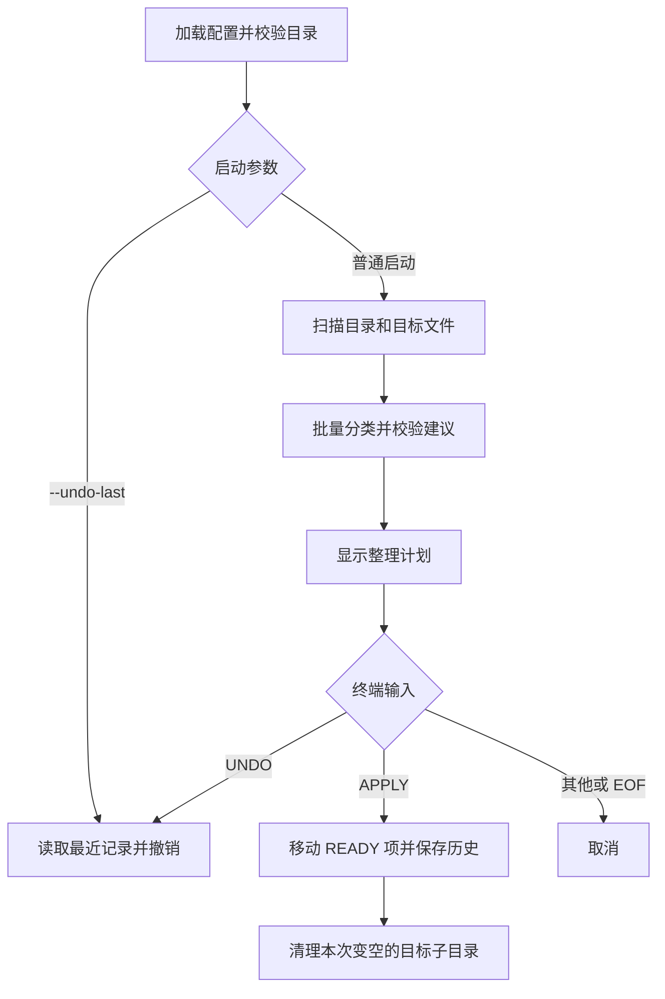

# 架构文档

更新：2026-09-26｜实现基线：0.2.0（`f7d6f4e`）

## 1. 技术与结构

Java 17 + Maven，运行时使用 JDK 标准库，测试使用 JUnit 5。当前实现集中在 [FileTidyingAssistant.java](../src/main/java/com/example/tidying/FileTidyingAssistant.java)，下表为逻辑职责，并非已拆分的独立模块。

| 职责 | 主要入口 | 输入 / 输出 |
| --- | --- | --- |
| 配置校验 | `Config.load`、`validateConfig` | 工作目录的配置文件 → 运行参数 |
| 目录与文件扫描 | `existingDirectories`、`structure`、`targetFiles` | 根目录 / 目标目录 → 目录索引、树、文件列表 |
| 分类调度 | `planAll`、`planBatch`、`classifyBatch` | 文件信息及目录树 → 批量建议 |
| 计划校验 | `buildPlan`、`resolveDestination` | AI 建议 → 可展示的逐文件计划 |
| 执行与清理 | `execute`、`deleteEmptyDirectories` | 已确认计划 → 文件移动及空目录清理 |
| 历史与撤销 | `writeHistory`、`undoLast` | 最近一次操作记录 → 反向恢复 |

## 2. 主流程

无待整理文件时直接退出；`--undo-last` 可跳过 AI 分析。文件稳定性仅通过间隔 300 毫秒的两次大小检查判断。

## 3. AI 接口与计划

- 固定线程池控制批次并发，默认 10 文件 / 批、2 批并发，请求超时 90 秒。
- 默认使用第三方 Responses 接口，也有 Chat Completions 分支；真实测试范围见[测试文档](testing.md)。
- Responses 使用 SSE；当前收齐响应后解析文本，终端输出阶段状态，不逐 token 展示。
- 请求包含相对路径、文件元数据、目录树；支持的文本格式附片段，批量最多 1,200 字符 / 文件，单文件最多 4,000 字符。
- 批量结果字段为 `source`、`destination`、`createDirectory`、`reason`，按源路径匹配；空响应重试一次，缺项或其他批量失败可退回单文件请求；401 / 403 单独处理。
- 无密钥时走本地扩展名规则。计划状态为 `READY`（可移动）、`UNCHANGED`（保留）、`CONFLICT`（同名冲突）、`FAILED`（失败）、`REVIEW`（待人工判断）。

## 4. 本地数据与边界

- 配置示例：[application.properties.example](../application.properties.example)；实际配置从进程工作目录读取。
- 历史位于 `sense.root/.bei-file-tidying/history/last-operation.json`，只保留最近一次操作，记录相对路径、文件大小、修改时间及创建 / 删除的目录。
- 历史通过临时文件替换写入，文件系统支持时采用原子替换；移动失败逐项报告，不提供整批事务保证。
- 撤销反向移动文件；依据大小和修改时间判断文件是否变化，不使用内容哈希。原位置冲突、目标丢失或已变化时不覆盖。
- 目录树跳过隐藏目录及符号链接目录；文件扫描仅按文件名过滤隐藏文件，尚未统一排除隐藏父目录。
- 目的地已有绝对路径、`.` / `..` 等基础检查；符号链接逃逸、严格 JSON 校验和中断恢复是待完善项。

相关文档：[需求](requirements.md) · [测试](testing.md) · [计划](project-plan.md)
